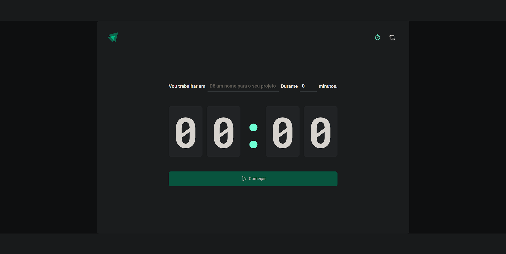
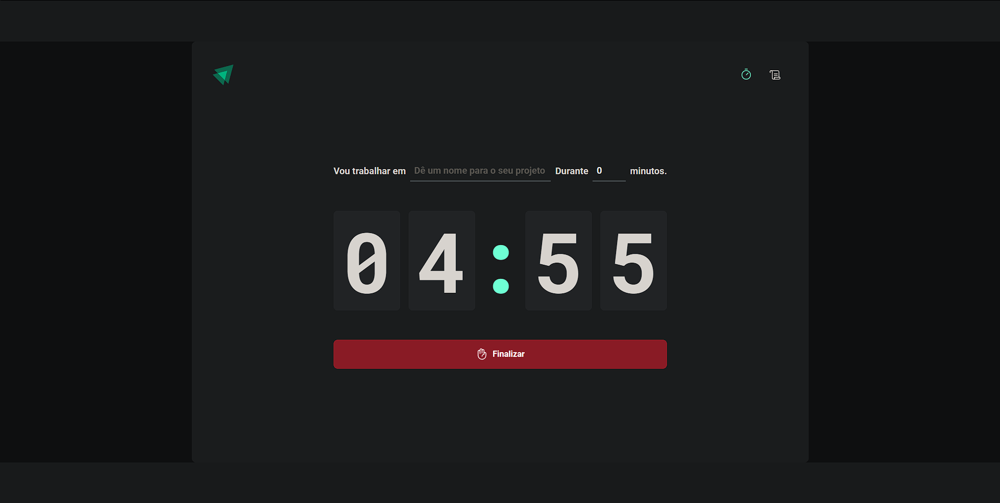
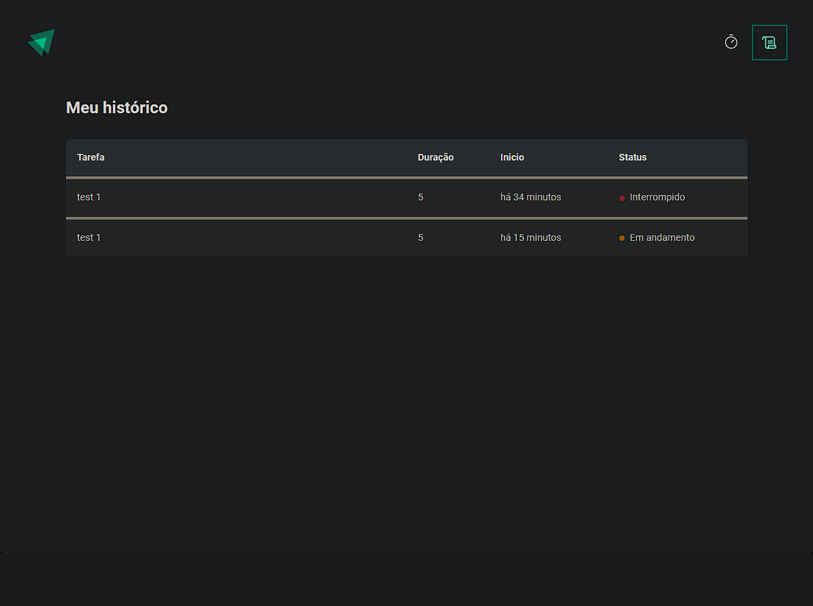

<h1>Timer</h1>
    <h2>•Linguagens usadas</h2>
    
•typescript

    
•reactjs

    
    
    
    
para inciar o projeto basta dar "npm i" para instalar todas as dependencias, após isso basta dar npm run dev
