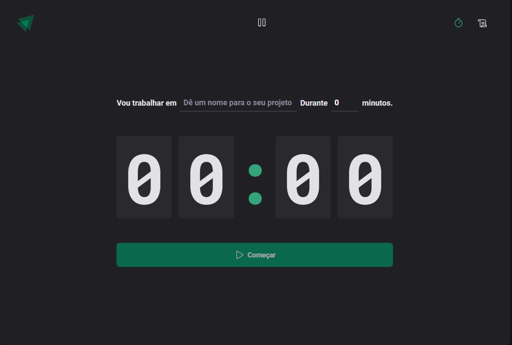

# Descrição do Projeto Ignite Timer

O Ignite Timer é um projeto de interface de usuário criado com o objetivo de ser uma ferramenta útil para pessoas que precisam gerenciar o tempo. O projeto foi criado utilizando as tecnologias TypeScript, React, HTML e CSS. 

## Funcionalidades

A principal funcionalidade do Ignite Timer é permitir que o usuário possa configurar um temporizador de contagem regressiva, permitindo assim que ele possa se concentrar em uma tarefa específica. Além disso, o projeto conta com um botão play, que toca uma música lo-fi de fundo para ajudar a criar um ambiente de concentração. 

Quando o timer chega ao fim, o usuário é notificado com um efeito sonoro, indicando que a contagem regressiva acabou e que ele pode agora ele pode começar um novo timer.

## Design

O design do Ignite Timer foi criado com um estilo moderno e minimalista, utilizando uma paleta de cores suave e elegante, com predominância de tons de cinza e azul claro. O uso de fontes serifadas confere um ar de sofisticação ao projeto, enquanto o contraste entre o branco e o preto garante uma leitura fácil e agradável.

A página inicial do projeto apresenta um header com um botão play para tocar a música de fundo. Nesta página, é possível configurar a duração do timer.

Na página do timer propriamente dito, a interface é minimalista e clara, com um grande display numérico mostrando o tempo restante e botões para começar e parar o timer.

## Conclusão

O Ignite Timer é um projeto de interface de usuário simples e útil, criado com o objetivo de ajudar as pessoas a gerenciar melhor seu tempo e aumentar a produtividade. Com um design elegante e minimalista, o projeto é fácil de usar e oferece recursos práticos e eficazes para o usuário.